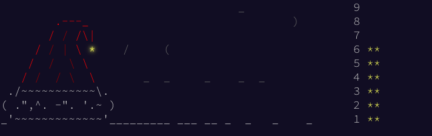

--- 
title: "Advent of Code 2018"
author: "María Paula Caldas"
date: "`r Sys.Date()`"
site: bookdown::bookdown_site
documentclass: book
description: "My attempt at the 2018 Advent of Code puzzles."
---

This was my attempt at the Advent of Code 2018. I got busy after day 6, and then didn't bother picking it up again. I had a good run though.



This code is far from perfect, and I think next time I will try to solve the puzzles in Python--R doesn't seem very well suited for these type of questions.

# Technical details {-}

I tried to solve this using packages from the `tidyverse`.

```{r, include=FALSE}
library(tidyverse)
```

My setup at the time:

```{r, echo=FALSE}
devtools::session_info()
```


```{r include=FALSE}
# automatically create a bib database for R packages
knitr::write_bib(c(
  .packages(), 'bookdown', 'knitr', 'rmarkdown'
), 'packages.bib')
```

